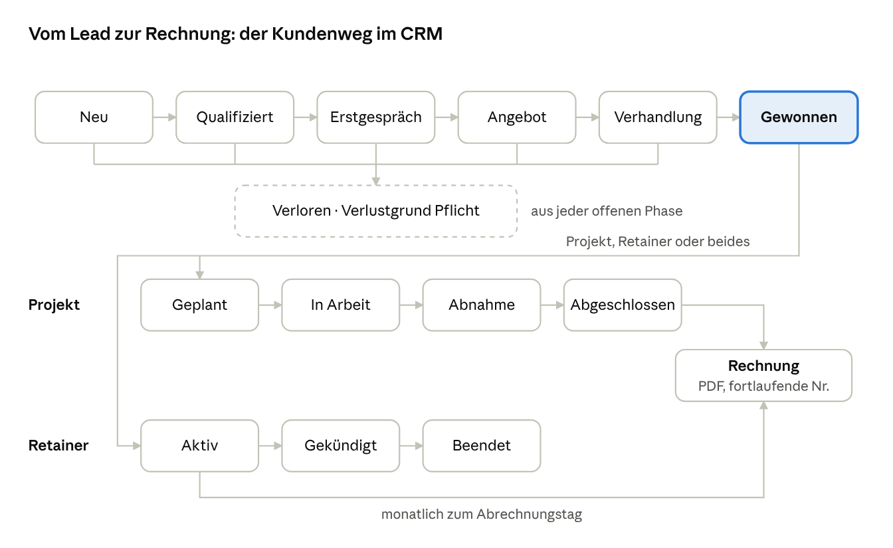

# Agentur-CRM – Pflichtenheft

Stand: 30.09.2026 · Fabian

## Ziel und Rahmen

Ein schlankes, selbstgebautes CRM für eine Ein-Personen-KI-Automatisierungsagentur, das den gesamten Kundenweg abdeckt: vom Lead über den Deal und das Projekt bis zum monatlichen Retainer und der Rechnung. Es ist per API und Webhooks voll in n8n eingebunden.

**Leitprinzip:** Jede Funktion muss im Alltag Zeit sparen. Alles, was n8n besser kann (E-Mails versenden, Datenanreicherung, KI-Auswertung), wird nicht ins CRM eingebaut, sondern per API angebunden.

| Entscheidung | Festlegung |
| --- | --- |
| Nutzer | Nur Fabian (ein Login, keine Rollen) |
| Umfang | Vertrieb, Projekte, Retainer, Rechnungen |
| Plattform | Web-App, mobil nutzbar (responsive) |
| Hosting | Vercel (EU) + Supabase (Frankfurt) |
| Sprache der Oberfläche | Deutsch |
| Währung | EUR, Beträge netto + USt. |

## Tech-Stack und Hosting

| Baustein | Wahl | Zweck |
| --- | --- | --- |
| Framework | Next.js (App Router), TypeScript | Oberfläche und API in einem Projekt |
| UI | Tailwind CSS, shadcn/ui | Schnelle, saubere Komponenten |
| Datenbank | Supabase Postgres, Region Frankfurt | Daten, Row-Level-Security |
| Login | Supabase Auth (E-Mail + Passwort, 2FA) | Zugang nur für Fabian |
| Dateien | Supabase Storage | Angebote, Verträge, Rechnungs-PDFs |
| PDF | @react-pdf/renderer | Angebote und Rechnungen erzeugen |
| Hosting | Vercel, Funktionsregion fra1 | Deployment per Git-Push |
| Code | GitHub (privates Repo) | Versionierung, Grundlage für Claude Code |

Datenbankänderungen laufen ausschließlich über Supabase-Migrationen im Repo, nie per Klick im Dashboard. So bleibt der Stand nachvollziehbar und reproduzierbar.

## Datenmodell

Zwölf Tabellen, alle mit `id` (uuid), `created_at`, `updated_at`. Die Firma ist der Anker: Kontakte, Deals, Projekte, Retainer und Rechnungen hängen an ihr.

| Tabelle | Wichtige Felder | Beziehung |
| --- | --- | --- |
| companies | name, website, branche, groesse, adresse, ust_id, kundennummer (z. B. K1001), mitarbeiterzahl, tool_stack (text[]), schmerzpunkte, automatisierungspotenzial (niedrig/mittel/hoch), notizen, status (Lead/Kunde/Ehemalig) | Anker |
| contacts | vorname, nachname, email, telefon, position, linkedin, ist_hauptkontakt, einwilligung_marketing, einwilligung_datum | gehört zu company |
| deals | titel, stage, wert_einmalig, wert_monatlich, wahrscheinlichkeit, erwarteter_abschluss, quelle, verlustgrund | gehört zu company, optional contact |
| activities | typ (Anruf/Mail/Meeting/Notiz), inhalt, zeitpunkt | an company, contact, deal oder project |
| tasks | titel, faellig_am, erledigt, prioritaet | an company, deal oder project |
| projects | titel, status, start, deadline, festpreis, interner_stundensatz | aus gewonnenem deal, gehört zu company |
| time_entries | datum, minuten, beschreibung (nur intern zur Kalkulation) | gehört zu project |
| retainers | titel, monatsbetrag, leistungsumfang, start, laufzeit_monate, kuendigungsfrist_tage, status, naechste_abrechnung | gehört zu company |
| quotes | nummer, positionen (jsonb), summe_netto, gueltig_bis, status, pdf_pfad | gehört zu deal |
| invoices | nummer, datum, faellig_am, positionen (jsonb), summe_netto, ust_satz, summe_brutto, status, pdf_pfad, xml_pfad | an company, optional project oder retainer |
| files | name, pfad, typ | an company, deal oder project |
| webhook_events | event, payload, gesendet_am, status | Protokoll ausgehender Webhooks |

Zusätzlich eine Einstellungstabelle `settings` für Firmendaten, Bankverbindung, Nummernkreise und den Standard-Umsatzsteuersatz.

## Pipeline- und Projektphasen

Sechs Vertriebsphasen führen zu „Gewonnen“; von dort entsteht ein Projekt, ein Retainer oder beides, und beide münden in Rechnungen.

- **Vertrieb:** Neu → Qualifiziert → Erstgespräch → Angebot → Verhandlung → **Gewonnen**. Aus jeder offenen Phase: Verloren (Verlustgrund Pflicht).
- **Nach „Gewonnen“:** Projekt, Retainer oder beides.
- **Projekt:** Geplant → In Arbeit → Abnahme → Abgeschlossen → Rechnung.
- **Retainer:** Aktiv → Gekündigt → Beendet; monatlich zum Abrechnungstag eine Rechnung.
- **Rechnung:** PDF, fortlaufende Nummer.

Die Phasen werden in einer Einstellungstabelle gepflegt, damit sie später umbenannt oder ergänzt werden können, ohne Code zu ändern.

## Funktionen je Modul

### Firmen und Kontakte

- Liste mit Suche, Filter (Status, Branche) und Sortierung
- Detailseite mit allen verknüpften Kontakten, Deals, Projekten, Retainern, Rechnungen und einer chronologischen Aktivitätenleiste
- Dublettenprüfung per E-Mail und Domain beim Anlegen
- CSV-Import und -Export

### Deals (Vertrieb)

- Kanban-Board mit Drag-and-drop zwischen den Phasen, Summe je Spalte
- Beim Wechsel auf „Verloren“ Pflichtfeld Verlustgrund
- Beim Wechsel auf „Gewonnen“ Dialog: Projekt anlegen, Retainer anlegen oder beides, mit übernommenen Werten
- Angebot aus dem Deal erzeugen (Positionen, PDF, Status Entwurf/Versendet/Angenommen/Abgelehnt)

### Aufgaben und Aktivitäten

- Schnellerfassung per Tastenkürzel von überall
- Ansicht „Heute“ mit fälligen und überfälligen Aufgaben
- Warnung, wenn ein offener Deal seit 14 Tagen keine Aktivität hat

### Projekte

- Liste und Detailseite mit Status, Deadline, Budget und Aufgaben
- Zeiterfassung mit Start/Stopp-Timer und manueller Nachtragung
- Rentabilität: erfasste Stunden × interner Stundensatz gegen den Festpreis

### Retainer

- Übersicht aller aktiven Retainer mit Summe der monatlich wiederkehrenden Umsätze (MRR)
- Hinweis 30 Tage vor Laufzeitende und vor Ablauf der Kündigungsfrist
- Monatliche Rechnungsentwürfe werden automatisch zum Abrechnungstag angelegt

### Rechnungen

- Erstellung aus Projekt (Festpreis, optional als Abschlags- und Schlussrechnung) oder Retainer
- Fortlaufende Nummer mit Kundennummer, z. B. RE-2026-0001-K1001; Angebote analog AN-2026-0001-K1001
- PDF mit Pflichtangaben nach § 14 UStG und ausgewiesener Umsatzsteuer (19 %), zusätzlich als E-Rechnung im ZUGFeRD-Format (PDF mit eingebettetem XML, Profil EN 16931)
- Status Entwurf/Versendet/Bezahlt/Überfällig, Überfälligkeit automatisch nach Fälligkeitsdatum
- Versendete Rechnungen sind nicht mehr änderbar, Korrektur nur per Stornorechnung

### Dashboard

- Pipeline-Wert gesamt und gewichtet nach Wahrscheinlichkeit
- MRR aus Retainern, offene Rechnungen, Umsatz im laufenden Monat und Jahr
- Aufgaben für heute, Deals ohne Aktivität, Projekte mit Deadline in den nächsten 7 Tagen

## API und n8n-Integration

Das CRM stellt eine REST-API unter `/api/v1` bereit und sendet bei wichtigen Ereignissen Webhooks an n8n. Damit wird der bestehende Lead-Qualifizierungs-Workflow direkt angebunden.

**Authentifizierung:** API-Keys, in den Einstellungen erzeugt, nur als Hash gespeichert, Header `Authorization: Bearer <key>`. Mehrere Keys möglich (z. B. einer pro n8n-Instanz), einzeln widerrufbar.

### Eingehende Endpunkte

| Methode | Pfad | Zweck |
| --- | --- | --- |
| POST | /api/v1/leads | Lead anlegen: Firma + Kontakt + Deal in Phase „Neu“, mit Dublettenabgleich |
| GET, POST, PATCH | /api/v1/companies | Firmen lesen, anlegen, ändern |
| GET, POST, PATCH | /api/v1/contacts | Kontakte lesen, anlegen, ändern |
| GET, PATCH | /api/v1/deals | Deals lesen, Phase und Felder ändern |
| POST | /api/v1/activities | Aktivität protokollieren, z. B. versendete Mail aus n8n |
| POST | /api/v1/tasks | Aufgabe anlegen |
| GET | /api/v1/invoices?status=overdue | Überfällige Rechnungen für Mahn-Workflow |

### Ausgehende Webhooks

Ziel-URL je Ereignis in den Einstellungen, signiert per HMAC-SHA256.

- `deal.created`, `deal.stage_changed`, `deal.won`, `deal.lost`
- `invoice.created`, `invoice.overdue`, `invoice.paid`
- `retainer.ending_soon`, `task.overdue`

Fehlgeschlagene Webhooks werden bis zu dreimal mit wachsendem Abstand wiederholt und in `webhook_events` protokolliert. Zeitgesteuerte Prüfungen (überfällige Rechnungen, Retainer-Fristen) laufen täglich per Vercel Cron.

## Datenschutz und Sicherheit

- [ ] AVV mit Supabase und Vercel abschließen, bevor echte Kundendaten importiert werden
- [ ] Supabase-Projekt in der Region Frankfurt anlegen, Vercel-Funktionen auf fra1
- [ ] Row-Level-Security auf allen Tabellen ab der ersten Migration, Zugriff nur für die eigene User-ID
- [ ] Zwei-Faktor-Login aktivieren, öffentliche Registrierung abschalten
- [ ] Service-Role-Key nur serverseitig, niemals im Browser-Code
- [ ] Löschfunktion je Kontakt und Firma inkl. Aktivitäten und Dateien (Art. 17 DSGVO); Rechnungen bleiben wegen Aufbewahrungspflicht erhalten
- [ ] Datenexport je Kontakt als JSON (Auskunftsrecht, Art. 15 DSGVO)
- [ ] Einwilligung für Marketing mit Datum speichern
- [ ] Tägliches Backup (Supabase Point-in-Time oder zusätzlicher Export)
- [ ] Eintrag ins Verzeichnis der Verarbeitungstätigkeiten

Falls Kundendaten später an die Claude-API gehen (z. B. Notizen zusammenfassen), ist auch dafür ein AVV nötig. Das wird vor Phase 4 geklärt.

## Nicht im Scope

Diese Punkte werden bewusst nicht gebaut, damit das Projekt fertig wird:

- Mehrere Nutzer, Rollen und Rechte
- E-Mail-Versand und Newsletter aus dem CRM (übernimmt n8n)
- Vollständige Buchhaltung, DATEV-Export und Bankabgleich (Rechnungen werden als PDF an die Buchhaltung weitergegeben)
- Mahnwesen mit Mahngebühren (Zahlungserinnerungen laufen per Webhook über n8n)
- Kundenportal für Kunden
- Native Desktop- oder Smartphone-App (die Web-App ist responsive)

## Umsetzungsplan

Fünf Phasen, jede endet mit einer lauffähigen, deployten Version. Eine Phase gilt erst als fertig, wenn alle Akzeptanzkriterien erfüllt sind.

1. **Fundament:** Repo, Next.js-Projekt, Supabase-Verbindung, Login mit 2FA, alle Tabellen als Migration inkl. RLS, Deployment auf Vercel.
   *Akzeptanz:* Login funktioniert, ohne Login ist keine Seite und keine Tabelle erreichbar, Deployment läuft per Git-Push.
2. **Vertrieb:** Firmen, Kontakte, Aktivitäten, Aufgaben, Deal-Kanban, Heute-Ansicht, CSV-Import.
   *Akzeptanz:* Ein Lead lässt sich anlegen, durch alle Phasen ziehen und als gewonnen oder verloren abschließen.
3. **n8n-Anbindung:** API-Keys, REST-Endpunkte, ausgehende Webhooks mit Signatur und Wiederholung.
   *Akzeptanz:* Der bestehende Lead-Workflow legt Leads per `POST /api/v1/leads` an, ein Phasenwechsel löst einen Webhook in n8n aus.
4. **Projekte, Retainer, Rechnungen:** Projekt aus gewonnenem Deal, Zeiterfassung, Retainer mit Fristen, Angebote und Rechnungen als PDF, Nummernkreise, täglicher Cron.
   *Akzeptanz:* Eine Festpreis-Rechnung und eine Retainer-Monatsrechnung entstehen korrekt als ZUGFeRD-PDF mit fortlaufender Nummer und Kundennummer.
5. **Dashboard und Feinschliff:** Kennzahlen, Löschen und Export je Kontakt, Backups, mobile Optimierung.
   *Akzeptanz:* Alle Punkte der Datenschutz-Checkliste sind abgehakt.

**Arbeitsweise mit Claude Code:** Dieses Dokument liegt als `docs/pflichtenheft.md` im Repo. Die `CLAUDE.md` verweist darauf und hält Stack, Konventionen und die aktuelle Phase fest. Pro Sitzung eine klar abgegrenzte Aufgabe, nach jedem funktionierenden Schritt ein Git-Commit.

## Entscheidungen

| Thema | Entscheidung |
| --- | --- |
| Pipeline-Phasen | Wie im Diagramm, keine zusätzliche Phase |
| Umsatzsteuer | Regelbesteuerung, 19 % USt. auf Rechnungen (vor der Gründung mit Steuerberater bestätigen) |
| Nummernschema | AN-2026-0001-K1001 und RE-2026-0001-K1001, jährlich neu hochzählend; Kundennummer K1001 fortlaufend |
| Projektabrechnung | Festpreis; Zeiterfassung nur intern für die Kalkulation |
| E-Rechnung | ZUGFeRD von Anfang an, umgesetzt in Phase 4 |
| Zusatzfelder Firma | Mitarbeiterzahl, genutzte Tools, Schmerzpunkte, Automatisierungspotenzial |
